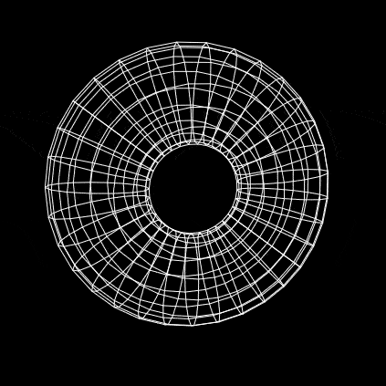
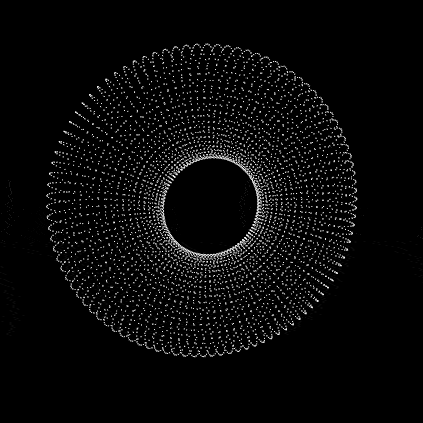

# Flutter 3D Rendering






This Flutter application provides a simple example of 3D rendering using custom painting. It renders a rotating 3D object on the screen.

Inspired by Coding Train's [Coding Challenge #112: 3D Rendering with Rotation and Projection](https://www.youtube.com/watch?v=p4Iz0XJY-Qk) by Daniel Shiffman.

## Usage

Import the package in your Dart code:

```dart
import 'package:flutter_3d_rendering/donut_renderer.dart';
import 'package:flutter_3d_rendering/render_painter.dart';
```

Create a `BaseRenderer` with an angle to control rotation:

```dart
final renderer = DonutRenderer(angle);
```

In your widget's `build` method, use the `CustomPaint` widget to display the object:

```dart
CustomPaint(
  size: const Size(400, 400),
  painter: RenderPainter(renderer),
)
```

To continuously rotate the object, you can use a timer or any other mechanism to update the angle over time. Here's an example using a timer:

```dart
Timer.periodic(const Duration(milliseconds: 16), (timer) {
  setState(() {
    angle += 0.01;
  });
});
```

## Matrix Helper and Vector

The package includes a `matrix_helper`.dart file that provides matrix manipulation functions for 3D transformations. Additionally, it includes a `vector.dart` file for working with 3D vectors.

## License

This package is released under the MIT License. See the [LICENSE](LICENSE) file for details.
